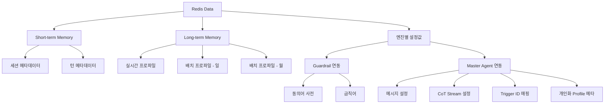

# Redis 데이터 정의서

> 버전: 1.0  
> 작성일: 2025-01-25 

---

## 📋 목차

1. [개요](#1-개요)
2. [데이터 분류 체계](#2-데이터-분류-체계)
3. [Key Naming Convention](#3-key-naming-convention)
4. [Short-term Memory (세션 데이터)](#4-short-term-memory-세션-데이터)
5. [Long-term Memory (개인화 프로파일)](#5-long-term-memory-개인화-프로파일)
6. [엔진별 설정값](#6-엔진별-설정값)
7. [Pub/Sub 채널 정의](#7-pubsub-채널-정의)
8. [메모리 관리 정책](#8-메모리-관리-정책)
9. [백업 및 복구 전략](#9-백업-및-복구-전략)
10. [운영 가이드](#10-운영-가이드)

---

## 1. 개요

### 1.1 목적
이 문서는 Master Agent에서 사용하는 Redis 데이터 구조를 정의합니다.

### 1.2 Redis 인스턴스 구성

| Pod | 용도 | 메모리 |
|---------|------|--------|
| redis | 모든 데이터 (세션 + 개인화 프로파일 + 엔진설정) | 20GB |

**주의**: 단일 인스턴스에서 모든 데이터를 관리하므로, TTL과 메모리 정책을 통해 데이터를 구분합니다.

### 1.3 데이터 보존 정책

```
Short-term Memory (세션 데이터):
- 세션 메타데이터: TTL 300초 (5분)

Long-term Memory (개인화 프로파일):
- 실시간 프로파일: 영구 (TTL 없음)
- 배치 프로파일 (일): 영구 (TTL 없음)
- 배치 프로파일 (월): 영구 (TTL 없음)
- 기존 mock 데이터로 되어있는 정보를 실시간 API 통해 가져온 정보와 배치로 가져온 정보를 합쳐서 저장하고 AGW가 세션 생성 시 해당 정보를 가져와서 Master Agent가 세션 조회 시 같이 보여줄 것
- 3개 다 아직 정의되어 있지 않음(1/25 기준)

엔진별 설정값:
- 동의어/금칙어: 영구 (TTL 없음)
- Trigger 매핑: 영구 (TTL 없음)
- 메시지 설정: 영구 (TTL 없음)
- CoT 설정: 영구 (TTL 없음)
- 프로파일 메타: 영구 (TTL 없음)
```

---

## 2. 데이터 분류 체계



---

## 3. Key Naming Convention

### 3.1 기본 규칙

```
{category}:{identifier}[:{subidentifier}]

예시:
session:gsess_20260108123456_abcd12
turns:gsess_20260108123456_abcd12
config:dict:synonym:tenant001
```

### 3.2 카테고리 정의

| 카테고리 | Prefix | TTL | 설명 |
|---------|--------|-----|------|
| 세션 메타데이터 | `session:` | 300초 | 세션 상태 및 정보 |
| 턴 데이터 | `turns:` | 300초 | 턴별 API 연동 결과 |
| 프로파일 | `profile:` | 없음 | 개인화 프로파일 |
| 설정 데이터 | `config:` | 없음 | 시스템 설정 |

### 3.3 식별자 규칙

- **Global Session Key**: `{prefix}_{timestamp}_{uuid6자리}` 형식 (예: `gsess_20260108123456_abcd12`)
  - prefix: `gsess` (기본값, 환경변수 `GLOBAL_SESSION_PREFIX`로 변경 가능)
  - timestamp: `%Y%m%d%H%M%S` 형식 (14자리)
  - uuid: UUID4의 hex 앞 6자리
- **User ID**: 문자열 (예: `user_001`, `0616001905`)
- **Agent ID**: 문자열, 최대 50자 (예: `transfer_agent`, `balance_agent`, `dbs_caller`)
- **Tenant ID**: 문자열, 최대 50자 (예: `tenant001`) - 설정값 관리용
- **Trigger ID**: 문자열, 최대 50자 (예: `trigger_001`) - 설정값 관리용

---

## 4. Short-term Memory (세션 데이터)

### 4.1 세션 메타데이터

**Key**: `session:{global_session_key}`

| 속성 | 값 |
|------|-----|
| **데이터 타입** | Hash |
| **TTL** | 300초 (5분) |
| **업데이트 주기** | 매 요청 |
| **크기 예상** | ~5KB |

#### 필드 정의

| 필드명 | 타입 | 필수 | 설명 | 예시 |
|--------|------|------|------|------|
| `global_session_key` | String | Y | Global 세션 키 | `gsess_20260108123456_abcd12` |
| `user_id` | String | Y | 사용자 ID | `0616001905` |
| `channel` | String | Y | 채널 | `web`, `kiosk`, `mobile` |
| `conversation_id` | String | N | 대화 ID | `conv_12345` (현재 빈 문자열) |
| `session_state` | String | Y | 세션 상태 | `start`, `talk`, `end` |
| `task_queue_status` | String | N | Task Queue 상태 | `null`, `pending`, `processing` |
| `subagent_status` | String | N | SubAgent 상태 | `undefined`, `continue`, `end` |
| `profile` | String | N | 프로파일 (JSON 문자열) | `{...}` |
| `customer_profile` | String | N | 고객 프로파일 스냅샷 (JSON) | 실시간 프로파일 스냅샷 |
| `start_type` | String | N | 세션 진입 유형 | `ICON_ENTRY` |
| `expires_at` | String | Y | 만료 시각 (ISO) | `2025-01-25T10:05:00Z` |
| `created_at` | String | Y | 생성 시각 (ISO) | `2025-01-25T10:00:00Z` |
| `updated_at` | String | Y | 업데이트 시각 (ISO) | `2025-01-25T10:03:00Z` |
| `reference_information` | String | N | 멀티턴 컨텍스트 (JSON) | `{"conversation_history":[...],"current_intent":"계좌조회","turn_count":4}` |
| `last_event` | String | N | 마지막 이벤트 (JSON) | `{"event_type":"AGENT_RESPONSE","agent_id":"balance_agent","agent_type":"task"}` |
| `turn_ids` | String | N | 턴 ID 목록 (JSON 배열) | `["turn_001", "turn_002", "turn_003"]` |
| `session_attributes` | String | N | 세션 속성 (JSON) | `{"account_no":"110-123-456789","memb_gd":"VIP"}` |
| `cushion_message` | String | N | 쿠션 메시지 | `계좌 정보를 확인하고 있습니다...` |
| `action_owner` | String | N | 현재 액션 담당자 (agent_id) | `balance_agent` |
| `close_reason` | String | N | 종료 사유 | `user_request`, `timeout` |
| `ended_at` | String | N | 종료 시각 (ISO) | `2025-01-25T10:05:00Z` |
| `final_summary` | String | N | 최종 요약 | `계좌 조회 완료` |

#### 예시 데이터

```json
{
  "global_session_key": "gsess_20260108123456_abcd12",
  "user_id": "0616001905",
  "channel": "web",
  "conversation_id": "",
  "session_state": "talk",
  "task_queue_status": "processing",
  "subagent_status": "continue",
  "profile": "{\"preferences\": {\"language\": \"ko\"}}",
  "customer_profile": "{\"cusnoS10\":\"0616001905\",\"cusSungNmS20\":\"홍길동\",\"hpNoS12\":\"01031286270\",\"biryrMmddS6\":\"710115\",\"onlyAgeN3\":55,...}",
  "start_type": "ICON_ENTRY",
  "expires_at": "2025-01-25T10:05:00Z",
  "created_at": "2025-01-25T10:00:00Z",
  "updated_at": "2025-01-25T10:03:00Z",
  "reference_information": "{\"conversation_history\":[{\"role\":\"user\",\"content\":\"계좌 잔액 조회하고 싶어요\"},{\"role\":\"assistant\",\"content\":\"계좌번호를 알려주세요\"},{\"role\":\"user\",\"content\":\"110-123-456789\"},{\"role\":\"assistant\",\"content\":\"잔액은 1,500,000원입니다\"}],\"current_intent\":\"계좌조회\",\"turn_count\":4,\"active_task\":{\"task_id\":\"task_001\",\"intent\":\"계좌조회\",\"skill_tag\":\"balance_inquiry\"},\"task_queue_status\":[{\"task_id\":\"task_001\",\"intent\":\"계좌조회\",\"status\":\"Running\",\"skill_tag\":\"balance_inquiry\"}]}",
  "last_event": "{\"event_type\":\"AGENT_RESPONSE\",\"agent_id\":\"balance_agent\",\"agent_type\":\"task\",\"response_type\":\"text\",\"updated_at\":\"2025-01-25T10:03:00Z\"}",
  "turn_ids": "[\"turn_001\", \"turn_002\", \"turn_003\", \"turn_004\"]",
  "session_attributes": "{\"account_no\":\"110-123-456789\",\"memb_gd\":\"VIP\"}",
  "cushion_message": "계좌 정보를 확인하고 있습니다...",
  "action_owner": "balance_agent",
  "close_reason": null,
  "ended_at": null,
  "final_summary": null
}
```

#### Redis 명령어 예시

```bash
# 세션 생성
HSET session:gsess_20260108123456_abcd12 \
  global_session_key "gsess_20260108123456_abcd12" \
  user_id "0616001905" \
  channel "web" \
  session_state "start" \
  created_at "2025-01-25T10:00:00Z"
EXPIRE session:gsess_20260108123456_abcd12 300

# 필드 업데이트 (대화이력 포함)
HSET session:gsess_20260108123456_abcd12 \
  session_state "talk" \
  updated_at "2025-01-25T10:03:00Z" \
  reference_information "{\"conversation_history\":[{\"role\":\"user\",\"content\":\"계좌 잔액 조회하고 싶어요\"},{\"role\":\"assistant\",\"content\":\"계좌번호를 알려주세요\"}],\"current_intent\":\"계좌조회\",\"turn_count\":2}" \
  action_owner "balance_agent" \
  cushion_message "계좌 정보를 확인하고 있습니다..."
EXPIRE session:gsess_20260108123456_abcd12 300

# 전체 조회
HGETALL session:gsess_20260108123456_abcd12

# TTL 확인
TTL session:gsess_20260108123456_abcd12

# 특정 필드 조회
HGET session:gsess_20260108123456_abcd12 user_id
HGET session:gsess_20260108123456_abcd12 customer_profile
```

---

### 4.2 턴 메타데이터

**Key**: `turns:{global_session_key}`

| 속성 | 값 |
|------|-----|
| **데이터 타입** | List (JSON 문자열 배열) |
| **TTL** | 300초 (5분) |
| **용도** | 실시간 API 연동 결과 (SOL API 등) |
| **크기 예상** | ~10KB (턴당 ~1KB, 평균 10턴 가정) |

#### 리스트 아이템 구조 (JSON String)

```json
{
  "turn_id": "turn_001",
  "timestamp": "2025-01-25T10:01:00Z",
  "metadata": {
    "sol_api": {
      "global_session_key": "gsess_20260108123456_abcd12",
      "turn_id": "turn_001",
      "agent": "balance_agent",
      "request": {
        "transactionPayload": [
          {
            "trxCd": "BAL001",
            "dataBody": {
              "accountNo": "110-123-456789"
            }
          }
        ]
      },
      "response": {
        "globId": "glob_12345",
        "requestId": "req_67890",
        "result": "SUCCESS",
        "resultCode": "0000",
        "resultMsg": "정상 처리",
        "transactionResult": [
          {
            "trxCd": "BAL001",
            "responseData": {
              "accountNo": "110-123-456789",
              "balance": 1500000,
              "currency": "KRW"
            }
          }
        ]
      }
    }
  }
}
```

#### Redis 명령어 예시

```bash
# 턴 추가 (최신이 앞에 오도록)
LPUSH turns:gsess_20260108123456_abcd12 '{"turn_id":"turn_001","timestamp":"2025-01-25T10:01:00Z","metadata":{"sol_api":{"global_session_key":"gsess_20260108123456_abcd12","turn_id":"turn_001","agent":"balance_agent","request":{"transactionPayload":[{"trxCd":"BAL001","dataBody":{"accountNo":"110-123-456789"}}]},"response":{"result":"SUCCESS","transactionResult":[{"trxCd":"BAL001","responseData":{"balance":1500000}}]}}}}}'
EXPIRE turns:gsess_20260108123456_abcd12 300

# 전체 턴 조회
LRANGE turns:gsess_20260108123456_abcd12 0 -1

# 최근 5개 턴만 조회
LRANGE turns:gsess_20260108123456_abcd12 0 4

# 턴 개수 확인
LLEN turns:gsess_20260108123456_abcd12

# 오래된 턴 제거 (최근 20개만 유지)
LTRIM turns:gsess_20260108123456_abcd12 0 19
EXPIRE turns:gsess_20260108123456_abcd12 300
```

---

## 5. Long-term Memory (개인화 프로파일)

### 5.1 실시간 프로파일

**Key**: `profile:realtime:{user_id}`  
**user_id**: 숫자 10자리 (cusnoS10 값, 예: `0616001905`)

| 속성 | 값 |
|------|-----|
| **데이터 타입** | String (JSON) |
| **TTL** | 없음 (영구) |
| **원본** | 외부 시스템 (실시간 연동) |
| **업데이트** | 실시간 |
| **크기 예상** | ~10KB |

#### 데이터 구조

실시간으로 연동되는 고객 프로파일 데이터입니다. 아래는 실제 데이터 예시입니다:

```json
{
  "cusnoS10": "0616001905",
  "cusSungNmS20": "홍길동",
  "hpNoS12": "01031286270",
  "telnoS20": "",
  "biryrMmddS6": "710115",
  "onlyAgeN3": 55,
  "secrityMdiaInfS1": "5",
  "smartOtpVndrS3": "512",
  "otpSerS12": "",
  "mAsCiNoS88": "",
  "rrgsNoS13": "*************",
  "cstmMenuJiWDsynS1": "",
  "sPinPadEntYnS1": "",
  "emalNtynN1": "",
  "pwmYnS1": "",
  "repScrModeS2": "09",
  "loginMthS1": "5",
  "loginLevS2": "1",
  "ioAmtAlimYnS1": "N",
  "tculbMngBrS4": "0",
  "tclubMngBrNmS40": "",
  "ygSexS1": "2",
  "homeTelnoS12": "0623830374",
  "useMachDrynS1": "",
  "exctMachLoginAlimYnS1": "0",
  "ansimTrxEntYnS1": "0",
  "guPcDrAgrYnS1": "",
  "ipjiAmtAcntN5": 3,
  "grid02Cnt": "",
  "grid03Cnt": "",
  "heyygIcheModeS2": "",
  "cusSungNmS30": "홍길동",
  "jehyusaHdovrCusnoS24": "23jIW5AU7p081ObnQkdkutOA",
  "smpIcheEntYnS1": "0",
  "dlayIcheUmS1": "N",
  "ciNoS88": "UD9ylKgi0ZkCV8FqaQAGhKH4bePBNjNWuOQS1v1ngbouFUzHkuHVFGI0zC3V+Kd9+2k9FiYqRTp3mNEqW6OyZA==",
  "cusSangtaeS2": "OK",
  "lastLogin": "",
  "photoDataB20000": "",
  "saupbG": 10,
  "actvBrnoS4": "2422",
  "loginDt": "2026.01.21",
  "loginTimesS6": "14:23:59",
  "newcifYn": "N",
  "opbDrdtS8": "",
  "d1IcheHnDoAmt": "",
  "cusTn1IcheHndoN13": "0",
  "opbDrynS1": "0",
  "otpCdExchgYnS1": "N",
  "scnoChgDsynS1": "",
  "sessionIdS100": "k1CqkBp94hftuRVZM4dFaa01Jxtm0egRougrKhRZndyQwgXjthEuYC2Hsb1ywwbx.c29sZG9tYWluL3NvbF8xMQ==",
  "depAcnoCnt": "",
  "tbnkAcnoCnt": "",
  "phishPrvtClseS16": "",
  "phishPrvtImgS8": "",
  "membGdS2": "02",
  "smartBnkgEntSangtaeS1": "0",
  "videoCallAuthDsynS1": "N"
}
```

#### 주요 필드 설명

| 필드명 | 설명 | 타입 |
|--------|------|------|
| `cusnoS10` | 고객번호 (User ID) | String(10) |
| `cusSungNmS20` | 고객성명 | String(20) |
| `hpNoS12` | 휴대폰번호 | String(12) |
| `biryrMmddS6` | 생년월일 (YYMMDD) | String(6) |
| `onlyAgeN3` | 나이 | Number(3) |
| `loginDt` | 최근 로그인일 | String(10) |
| `loginTimesS6` | 최근 로그인시간 | String(6) |
| `membGdS2` | 회원등급 | String(2) |
| `cusSangtaeS2` | 고객상태 | String(2) |

#### Redis 명령어 예시

```bash
# 실시간 프로파일 저장
SET profile:realtime:0616001905 '{"cusnoS10":"0616001905","cusSungNmS20":"홍길동",...}'

# 조회
GET profile:realtime:0616001905

# 존재 여부 확인
EXISTS profile:realtime:0616001905

# 패턴 검색
KEYS profile:realtime:*
```

---

### 5.2 배치 프로파일 (일 기준)

**Key**: `profile:batch:daily:{user_id}`  
**user_id**: 숫자 10자리 (cusnoS10 값, 예: `0616001905`)

| 속성 | 값 |
|------|-----|
| **데이터 타입** | String (JSON) |
| **TTL** | 없음 (영구) |
| **원본** | 배치 시스템 (일 단위 집계) |
| **업데이트** | 일 1회 |
| **크기 예상** | ~5KB |

#### 데이터 구조 (예상)

```json
{
  "cusnoS10": "0616001905",
  "date": "2025-01-25",
  "stats": {
    "login_count": 3,
    "transaction_count": 5,
    "total_amount": 150000,
    "last_transaction_time": "2025-01-25T18:30:00Z"
  },
  "behaviors": {
    "most_used_service": "계좌조회",
    "preferred_time": "오후",
    "channel_usage": {
      "web": 2,
      "mobile": 1
    }
  },
  "updated_at": "2025-01-26T02:00:00Z"
}
```

**주의**: 실제 컬럼은 아직 정해지지 않았으므로, 위 구조는 예시입니다.

#### Redis 명령어 예시

```bash
# 배치 프로파일 저장
SET profile:batch:daily:0616001905 '{"cusnoS10":"0616001905","date":"2025-01-25",...}'

# 조회
GET profile:batch:daily:0616001905

# 패턴 검색 (특정 날짜의 모든 프로파일)
KEYS profile:batch:daily:*
```

---

### 5.3 배치 프로파일 (월 기준)

**Key**: `profile:batch:monthly:{user_id}`  
**user_id**: 숫자 10자리 (cusnoS10 값, 예: `0616001905`)

| 속성 | 값 |
|------|-----|
| **데이터 타입** | String (JSON) |
| **TTL** | 없음 (영구) |
| **원본** | 배치 시스템 (월 단위 집계) |
| **업데이트** | 월 1회 |
| **크기 예상** | ~8KB |

#### 데이터 구조 (예상)

```json
{
  "cusnoS10": "0616001905",
  "year_month": "2025-01",
  "summary": {
    "total_login_count": 45,
    "total_transaction_count": 78,
    "total_amount": 3500000,
    "avg_daily_usage": 1.5
  },
  "preferences": {
    "favorite_services": ["계좌조회", "이체", "대출조회"],
    "peak_usage_day": "월요일",
    "vip_eligibility": true
  },
  "updated_at": "2025-02-01T02:00:00Z"
}
```

**주의**: 실제 컬럼은 아직 정해지지 않았으므로, 위 구조는 예시입니다.

#### Redis 명령어 예시

```bash
# 배치 프로파일 저장
SET profile:batch:monthly:0616001905 '{"cusnoS10":"0616001905","year_month":"2025-01",...}'

# 조회
GET profile:batch:monthly:0616001905

# 패턴 검색
KEYS profile:batch:monthly:*
```

---

### 5.4 프로파일 데이터 정렬 및 중복 제거

개인화 프로파일은 실시간과 배치로 수집되므로, 저장 전에 정렬 및 중복 제거가 필요합니다.

#### 처리 로직 (예시)

```python
def save_profile(user_id, realtime_data, daily_data, monthly_data):
    """프로파일 저장 - 정렬 및 중복 제거"""
    
    # 1. 실시간 데이터 정렬 (키 알파벳 순)
    sorted_realtime = dict(sorted(realtime_data.items()))
    
    # 2. 중복 필드 제거 (실시간이 우선)
    # 배치 데이터에서 실시간과 겹치는 필드 제거
    daily_unique = {k: v for k, v in daily_data.items() 
                    if k not in sorted_realtime}
    monthly_unique = {k: v for k, v in monthly_data.items() 
                      if k not in sorted_realtime and k not in daily_unique}
    
    # 3. Redis 저장
    redis.set(f"profile:realtime:{user_id}", json.dumps(sorted_realtime))
    redis.set(f"profile:batch:daily:{user_id}", json.dumps(daily_unique))
    redis.set(f"profile:batch:monthly:{user_id}", json.dumps(monthly_unique))
```

---

## 6. 엔진별 설정값

### 6.1 Guardrail 연동 설정

Guardrail 엔진에서 참조하는 설정 데이터입니다.

#### 6.1.1 동의어 사전

**Key**: `config:dict:synonym:{tenant_id}`

| 속성 | 값 |
|------|-----|
| **데이터 타입** | Hash |
| **TTL** | 없음 (영구) |
| **원본** | Portal DB |
| **연동 엔진** | Guardrail |
| **크기 예상** | ~100KB (테넌트당) |

##### 필드 정의

각 필드는 `대표어: 동의어 리스트(JSON Array String)` 형태입니다.

| 필드 (대표어) | 값 (동의어 리스트) |
|---------------|-------------------|
| `계좌` | `["통장", "어카운트", "계좌번호"]` |
| `이체` | `["송금", "보내기", "입금", "출금"]` |
| `대출` | `["융자", "차입", "대출금"]` |

##### 예시 데이터

```json
{
  "계좌": "[\"통장\", \"어카운트\", \"계좌번호\"]",
  "이체": "[\"송금\", \"보내기\", \"입금\", \"출금\"]",
  "대출": "[\"융자\", \"차입\", \"대출금\"]",
  "예금": "[\"적금\", \"정기예금\", \"자유예금\"]",
  "카드": "[\"신용카드\", \"체크카드\", \"카드번호\"]"
}
```

##### Redis 명령어 예시

```bash
# 동의어 추가
HSET config:dict:synonym:tenant001 "계좌" '["통장","어카운트","계좌번호"]'

# 전체 조회
HGETALL config:dict:synonym:tenant001

# 특정 동의어 조회
HGET config:dict:synonym:tenant001 "계좌"

# 동의어 수정
HSET config:dict:synonym:tenant001 "계좌" '["통장","어카운트","계좌번호","뱅킹"]'

# 동의어 삭제
HDEL config:dict:synonym:tenant001 "계좌"
```

---

#### 6.1.2 금칙어

**Key**: `config:dict:forbidden:{tenant_id}`

| 속성 | 값 |
|------|-----|
| **데이터 타입** | Set |
| **TTL** | 없음 (영구) |
| **원본** | Portal DB |
| **연동 엔진** | Guardrail |
| **크기 예상** | ~10KB (테넌트당) |

##### 예시 데이터

```
금칙어1
금칙어2
비속어3
부적절한표현4
욕설5
```

##### Redis 명령어 예시

```bash
# 금칙어 추가
SADD config:dict:forbidden:tenant001 "금칙어1" "금칙어2" "비속어3"

# 전체 조회
SMEMBERS config:dict:forbidden:tenant001

# 특정 단어 확인
SISMEMBER config:dict:forbidden:tenant001 "금칙어1"

# 금칙어 제거
SREM config:dict:forbidden:tenant001 "금칙어1"

# 개수 확인
SCARD config:dict:forbidden:tenant001
```

---

### 6.2 Master Agent 연동 설정

Master Agent에서 참조하는 설정 데이터입니다.

#### 6.2.1 메시지 설정

Master Agent에서 사용하는 각종 답변 메시지를 정의합니다.

##### 되묻기 답변 메시지

**Key**: `config:message:rephrase:{tenant_id}`

| 속성 | 값 |
|------|-----|
| **데이터 타입** | String |
| **TTL** | 없음 (영구) |
| **연동 엔진** | Master Agent |

**예시 데이터**:
```
"조금 더 자세히 설명해주시겠어요?"
```

---

##### 금칙어 답변 메시지

**Key**: `config:message:forbidden:{tenant_id}`

**예시 데이터**:
```
"적절하지 않은 표현이 포함되어 있습니다. 정중한 표현으로 다시 말씀해주세요."
```

---

##### Fallback 답변 메시지

**Key**: `config:message:fallback:{tenant_id}`

**예시 데이터**:
```
"죄송합니다. 이해하지 못했습니다. 다시 말씀해주시겠어요?"
```

---

##### 가드레일 메시지

**Key**: `config:message:guardrail:{tenant_id}`

**예시 데이터**:
```
"보안을 위해 해당 정보는 제공할 수 없습니다."
```

---

##### 쿠션 메시지

**Key**: `config:message:cushion:{tenant_id}`

**예시 데이터**:
```
"잠시만 기다려주세요. 정보를 확인하고 있습니다..."
```

---

##### Redis 명령어 예시

```bash
# 메시지 저장
SET config:message:rephrase:tenant001 "조금 더 자세히 설명해주시겠어요?"
SET config:message:forbidden:tenant001 "적절하지 않은 표현이 포함되어 있습니다."
SET config:message:fallback:tenant001 "죄송합니다. 이해하지 못했습니다."
SET config:message:guardrail:tenant001 "보안을 위해 해당 정보는 제공할 수 없습니다."
SET config:message:cushion:tenant001 "잠시만 기다려주세요..."

# 조회
GET config:message:rephrase:tenant001

# 패턴 검색 (특정 테넌트의 모든 메시지)
KEYS config:message:*:tenant001
```

---

#### 6.2.2 CoT Stream 설정

**Key**: `config:cot:{agent_id}`

| 속성 | 값 |
|------|-----|
| **데이터 타입** | String |
| **TTL** | 없음 (영구) |
| **연동 엔진** | Master Agent |
| **가능한 값** | `"on"`, `"off"` |

##### 예시 데이터

```bash
# Agent별 CoT 설정
GET config:cot:master_agent
> "on"

GET config:cot:task_agent
> "off"
```

##### Redis 명령어 예시

```bash
# CoT 활성화
SET config:cot:master_agent "on"

# CoT 비활성화
SET config:cot:task_agent "off"

# 조회
GET config:cot:master_agent

# 모든 CoT 설정 조회
KEYS config:cot:*
```

---

#### 6.2.3 Trigger ID 매핑 정보

**Key**: `config:trigger:{trigger_id}`

| 속성 | 값 |
|------|-----|
| **데이터 타입** | Hash |
| **TTL** | 없음 (영구) |
| **연동 엔진** | Master Agent |
| **크기 예상** | ~500 bytes |

##### 필드 정의

| 필드명 | 타입 | 필수 | 설명 | 예시 |
|--------|------|------|------|------|
| `trigger_id` | String | Y | Trigger ID | `trigger_001` |
| `agent_type` | String | Y | Agent 타입 | `knowledge`, `task` |
| `utterance` | String | Y | 발화 예시 | `계좌 조회` |

##### 예시 데이터

```json
{
  "trigger_id": "trigger_001",
  "agent_type": "task",
  "utterance": "계좌 잔액 확인"
}
```

```json
{
  "trigger_id": "trigger_002",
  "agent_type": "knowledge",
  "utterance": "영업시간 문의"
}
```

##### Redis 명령어 예시

```bash
# Trigger 매핑 생성
HSET config:trigger:trigger_001 \
  trigger_id "trigger_001" \
  agent_type "task" \
  utterance "계좌 잔액 확인"

HSET config:trigger:trigger_002 \
  trigger_id "trigger_002" \
  agent_type "knowledge" \
  utterance "영업시간 문의"

# 전체 조회
HGETALL config:trigger:trigger_001

# Agent 타입 조회
HGET config:trigger:trigger_001 agent_type

# 모든 Trigger 조회
KEYS config:trigger:*
```

---

#### 6.2.4 개인화 Profile 메타 설정

**Key**: `config:profile_meta:{context_name}`

| 속성 | 값 |
|------|-----|
| **데이터 타입** | Hash |
| **TTL** | 없음 (영구) |
| **연동 엔진** | Master Agent |
| **크기 예상** | ~1KB |

##### 필드 정의

| 필드명 | 타입 | 필수 | 설명 | 예시 |
|--------|------|------|------|------|
| `context_name` | String | Y | Context 명 | `customer_info` |
| `source_system` | String | Y | Source System | `CRM`, `CoreBanking` |
| `sync_interval` | String | Y | 연동 주기 | `realtime`, `daily`, `monthly` |
| `description` | String | Y | Context 설명 | `고객 기본 정보` |
| `use_knowledge_agent` | String | Y | 지식 Agent 사용 여부 | `Y`, `N` |
| `use_task_agent` | String | Y | 업무 Agent 사용 여부 | `Y`, `N` |

##### 예시 데이터

```json
{
  "context_name": "customer_basic_info",
  "source_system": "CRM",
  "sync_interval": "realtime",
  "description": "고객 기본 정보 (성명, 연락처, 나이 등)",
  "use_knowledge_agent": "Y",
  "use_task_agent": "Y"
}
```

```json
{
  "context_name": "customer_transaction_daily",
  "source_system": "CoreBanking",
  "sync_interval": "daily",
  "description": "일별 거래 통계 정보",
  "use_knowledge_agent": "N",
  "use_task_agent": "Y"
}
```

##### Redis 명령어 예시

```bash
# Profile 메타 설정 생성
HSET config:profile_meta:customer_basic_info \
  context_name "customer_basic_info" \
  source_system "CRM" \
  sync_interval "realtime" \
  description "고객 기본 정보 (성명, 연락처, 나이 등)" \
  use_knowledge_agent "Y" \
  use_task_agent "Y"

HSET config:profile_meta:customer_transaction_daily \
  context_name "customer_transaction_daily" \
  source_system "CoreBanking" \
  sync_interval "daily" \
  description "일별 거래 통계 정보" \
  use_knowledge_agent "N" \
  use_task_agent "Y"

# 전체 조회
HGETALL config:profile_meta:customer_basic_info

# 특정 필드 조회
HGET config:profile_meta:customer_basic_info source_system

# 모든 Profile 메타 조회
KEYS config:profile_meta:*
```

---

### 6.3 엔진별 설정 요약

| 엔진 | 참조하는 설정 Key | 용도 |
|------|-------------------|------|
| **Guardrail** | `config:dict:synonym:{tenant_id}` | 동의어 사전 |
| | `config:dict:forbidden:{tenant_id}` | 금칙어 |
| **Master Agent** | `config:message:*:{tenant_id}` | 답변 메시지 (되묻기, 금칙어, fallback, 가드레일, 쿠션) |
| | `config:cot:{agent_id}` | CoT Stream on/off |
| | `config:trigger:{trigger_id}` | Trigger ID 매핑 (지식/업무 구분, 발화) |
| | `config:profile_meta:{context_name}` | 개인화 Profile 메타 설정 |

---

## 7. Pub/Sub 채널 정의

### 7.1 채널 구조

```
channel:{category}:{action}
```

### 7.2 채널 목록

| 채널명 | 용도 | 구독 대상 | 메시지 포맷 |
|--------|------|-----------|------------|
| `channel:dict:update` | 동의어/금칙어 업데이트 | Guardrail | [7.3 참조](#73-메시지-포맷) |
| `channel:message:update` | 메시지 템플릿 변경 | Master Agent | [7.3 참조](#73-메시지-포맷) |
| `channel:cot:update` | CoT 설정 변경 | Master Agent | [7.3 참조](#73-메시지-포맷) |
| `channel:trigger:update` | Trigger 매핑 변경 | Master Agent | [7.3 참조](#73-메시지-포맷) |
| `channel:profile:update` | 프로파일 업데이트 | Session Manager | [7.3 참조](#73-메시지-포맷) |
| `channel:profile_meta:update` | Profile 메타 설정 변경 | Master Agent | [7.3 참조](#73-메시지-포맷) |

### 7.3 메시지 포맷

#### 표준 메시지 구조

```json
{
  "event_id": "evt_1234567890",
  "event_type": "config_update",
  "category": "synonym",
  "action": "create",
  "timestamp": "2025-01-25T10:30:00Z",
  "publisher": "portal-service",
  "target": {
    "tenant_id": "tenant001",
    "agent_id": "master_agent",
    "trigger_id": "trigger_001"
  },
  "data": {
    "key": "config:dict:synonym:tenant001",
    "old_value": null,
    "new_value": {
      "계좌": ["통장", "어카운트", "계좌번호"]
    }
  }
}
```

#### Action 타입

| Action | 설명 |
|--------|------|
| `create` | 새 항목 생성 |
| `update` | 기존 항목 수정 |
| `delete` | 항목 삭제 |
| `sync` | 전체 동기화 요청 |

### 7.4 Pub/Sub 명령어 예시

```bash
# 구독
SUBSCRIBE channel:dict:update

# 발행
PUBLISH channel:dict:update '{"event_type":"config_update","category":"synonym","action":"create",...}'

# 패턴 구독 (모든 dict 관련 채널)
PSUBSCRIBE channel:dict:*

# 구독자 수 확인
PUBSUB NUMSUB channel:dict:update
```

---

## 8. 메모리 관리 정책

### 8.1 메모리 제한

| 설정 | 값 |
|------|-----|
| maxmemory | 20GB |
| maxmemory-policy | allkeys-lru |

**주의**: 단일 인스턴스이므로 `allkeys-lru` 정책을 사용하여 TTL과 관계없이 가장 오래 사용되지 않은 키를 삭제합니다.

### 8.2 메모리 모니터링

```bash
# 메모리 사용량 확인
INFO memory

# 키별 메모리 사용량
MEMORY USAGE session:GSK1234567890ABCD

# 샘플링으로 큰 키 찾기
redis-cli --bigkeys
```

---

## 9. 백업 및 복구 전략

### 9.1 영속화 설정

#### RDB (Snapshot)

```conf
# redis.conf
save 900 1      # 15분 동안 1개 이상 변경 시
save 300 10     # 5분 동안 10개 이상 변경 시
save 60 10000   # 1분 동안 10000개 이상 변경 시

dir /data
dbfilename dump.rdb
```

#### AOF (Append Only File)

```conf
# redis.conf
appendonly yes
appendfilename "appendonly.aof"
appendfsync everysec
```

### 9.2 백업 전략

| 타입 | 주기 | 보관 기간 | 저장 위치 |
|------|------|----------|----------|
| RDB | 1시간 | 24시간 | PersistentVolume |
| AOF | 실시간 | 최신 1개 | PersistentVolume |
| 외부 백업 | 1일 | 7일 | S3 / Object Storage |

---

## 10. 운영 가이드

### 10.1 일상 운영 작업

#### 세션 정리

```bash
# TTL 만료로 자동 삭제됨
# 수동 확인
KEYS session:*
TTL session:GSK1234567890ABCD

# 만료된 세션 확인 (TTL -2)
for key in $(redis-cli KEYS "session:*"); do
  ttl=$(redis-cli TTL "$key")
  if [ "$ttl" -eq -2 ]; then
    echo "Expired: $key"
  fi
done
```

#### 설정 동기화

```bash
# Portal에서 Redis 전체 동기화 API 호출
curl -X POST http://portal-api/api/config/sync
```

### 10.2 모니터링 지표

| 지표 | 명령어 | 임계값 |
|------|--------|--------|
| 메모리 사용률 | `INFO memory` | 80% 이하 |
| 연결 수 | `INFO clients` | 1000 이하 |
| 키 개수 | `DBSIZE` | - |
| Hit Rate | `INFO stats` | 90% 이상 |
| Evicted Keys | `INFO stats` | 0 (이상적) |

### 10.3 장애 대응

#### Redis 응답 없음

```bash
# 1. Health Check
redis-cli ping

# 2. Pod 상태 확인
kubectl get pods -l app=redis

# 3. 로그 확인
kubectl logs redis-0

# 4. 재시작 (최후 수단)
kubectl delete pod redis-0
```

#### 메모리 부족

```bash
# 1. 큰 키 찾기
redis-cli --bigkeys

# 2. 키 개수 확인
redis-cli DBSIZE

# 3. TTL 없는 키 확인 (설정값)
redis-cli KEYS "config:*" | wc -l

# 4. 세션 키 확인
redis-cli KEYS "session:*" | wc -l

# 5. 메모리 정책 확인
redis-cli CONFIG GET maxmemory-policy
```

---

## 부록 A: 전체 Key 목록

### Short-term Memory (TTL 300초)

```
session:{global_session_key}
turns:{global_session_key}
```

### Long-term Memory (영구)

```
profile:realtime:{user_id}
profile:batch:daily:{user_id}
profile:batch:monthly:{user_id}
```

### 엔진별 설정값 (영구)

```
# Guardrail 연동
config:dict:synonym:{tenant_id}
config:dict:forbidden:{tenant_id}

# Master Agent 연동
config:message:rephrase:{tenant_id}
config:message:forbidden:{tenant_id}
config:message:fallback:{tenant_id}
config:message:guardrail:{tenant_id}
config:message:cushion:{tenant_id}
config:cot:{agent_id}
config:trigger:{trigger_id}
config:profile_meta:{context_name}
```

---

## 부록 B: 데이터 크기 예상

### Short-term Memory (동시 세션 10,000개 기준)

| 키 패턴 | 개당 크기 | 개수 | 총 크기 |
|---------|----------|------|---------|
| `session:*` | 5KB | 10,000 | 50MB |
| `turns:*` | 10KB | 10,000 | 100MB |
| **총계** | | | **~150MB** |

### Long-term Memory (사용자 100,000명 기준)

| 키 패턴 | 개당 크기 | 개수 | 총 크기 |
|---------|----------|------|---------|
| `profile:realtime:*` | 10KB | 100,000 | 1GB |
| `profile:batch:daily:*` | 5KB | 100,000 | 500MB |
| `profile:batch:monthly:*` | 8KB | 100,000 | 800MB |
| **총계** | | | **~2.3GB** |

### 엔진별 설정값 (100 테넌트 기준)

| 키 패턴 | 개당 크기 | 개수 | 총 크기 |
|---------|----------|------|---------|
| `config:dict:synonym:*` | 100KB | 100 | 10MB |
| `config:dict:forbidden:*` | 10KB | 100 | 1MB |
| `config:message:*` | 500B | 500 | 250KB |
| `config:cot:*` | 10B | 100 | 1KB |
| `config:trigger:*` | 500B | 1000 | 500KB |
| `config:profile_meta:*` | 1KB | 50 | 50KB |
| **총계** | | | **~12MB** |

**총 메모리 사용량 예상**: ~2.5GB (여유분 포함 20GB 충분)

---

## 부록 C: 변경 이력

| 버전 | 날짜 | 작성자 | 변경 내용 |
|------|------|--------|----------|
| 1.0 | 2025-01-25 | 세션관리팀 | 초안 작성 |
| 2.0 | 2025-01-25 | 세션관리팀 | 실제 시스템 구조 반영 |

---

## 부록 D: 참고 자료

- [Redis 공식 문서](https://redis.io/documentation)
- [Redis 데이터 타입](https://redis.io/docs/data-types/)
- [Redis Persistence](https://redis.io/docs/management/persistence/)
- [Redis Pub/Sub](https://redis.io/docs/interact/pubsub/)